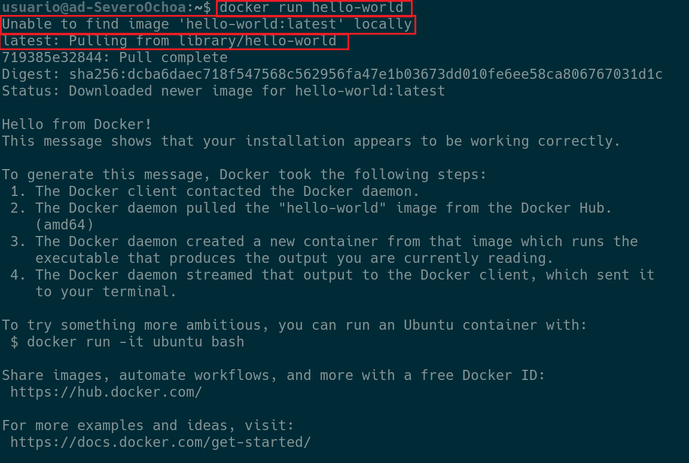

# **Comandos Básicos en Docker**

!!! danger "Crear un contenedor" 
    
 🔥 docker [ run | start | stop | restart ] [OPCIONES] [contenedor] 🔥 

| Argumentos    | 
 Función 
      |
| :----: | :-- |
| `run`   | Crea y arranca un contenedor --> Si lo ejecutas varias veces ejecutas varios contenedores.          |
| `start | stop |restart`    | Arranca/Detiene/Reinicia un contenedor ya existente.                                           |
| `-d`    | Arranca en segundo plano.                                         |
| `-p`     | Traducción de puertos entre el contenedor y la máquina anfitriona. Solo se puede hacer a la hora de crear la máquina.            |
| `--name`     | Nombre de la máquina.                                        |
| `-it`      | Redirige la salida al terminal del contenedor, es decir, accedes al terminal del contenedor.      |

### **Comandos.** 

Si nos fijamos en la salida vemos que lo primero que hace es buscar la imagen “hello-world” en local, al no encontrarlo, lo descarga de un repositorio de docker y posteriormente lo ejecuta. 
Si lo ejecutáis una segunda vez el código ya se ejecutará directamente en local (/var/lib/docker/).
También podemos apreciar que la imagen que se carga es “hello-world:latest”, es decir, la última versión de la imagen del contenedor.

<figure>
  
</figure>

!!! info "Mostrar los contenedores del sistema, tanto parados como activos" 
    
 🔥 docker ps [opciones] 🔥 

    
    ✨ Con –a se muestran todos los contenedores, los activos y los detenidos.
    
    ✨ Una vez sabemos su “nombre” o su “ID” podemos arrancarlo/pararlo/reiniciarlo.

!!! info "Copiar o renombrar contenedores." 
    
 🔥 docker [ cp |rename ] [contenedor] 🔥 
 

!!! info "Ejecutar comandos dentro del contenedor" 
    
 🔥 docker exec [OPCIONES] NombreContenedor Comando [ArgumentosComando] 🔥 

    
    ✨ -d: Ejecuta en segundo plano.
    
    ✨-it: Enlaza la entrada y salida a nuestro terminal. Es como entrar al terminal del contenedor.

!!! info "Acceder a los logs de ejecución del contenedor."  
    
 🔥 docker logs [OPCIONES] NombreContenedor 🔥 

!!! info "Listar todos los contenedores." 
    
 🔥 docker container ls –a 🔥 

!!! info "Eliminar un contenedor" 
    
 🔥 docker container rm NombreContenedor 🔥 

    ✨ Elimina un contenedor.

!!! info "Crear una imagen a partir de un contenedor" 
    
 🔥 docker commit contenedor imagen 🔥 

    ✨Crear una imagen de un contenedor es la forma más sencilla para subir nuestro contenedor a la nube o para hacer un backup local.

