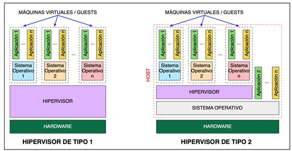
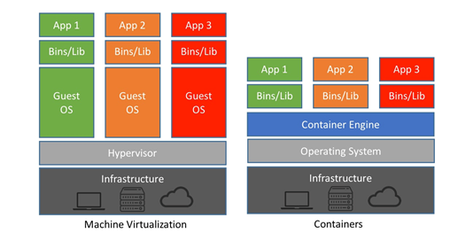
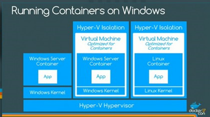

# **Máquinas virtuales y Contenedores.**

## **¿Qué es la virtualización?**

Permite reservar una serie de recursos del sistema (RAM, CPU, DISCO) para emular un sistema operativo (guest  / invitado) dentro de otro (host / anfitrión).

**Ventajas:**

* Podemos aprovechar mejor el hardware de la máquina anfitriona, ya que estamos ejecutando varios "ordenadores" en uno mismo, aprovechando recursos que de otra forma es posible que no se llegaran a usar.
* Permite ejecutar software que quizá sea incompatible con tu sistema operativo anfitrión, ya sea por un motivo de versiones o porque son sistemas operativos diferentes (Windows, Linux, MAC).

## **¿Qué es un Hipervisor?**

El hipervisor es la parte software que permite crear y gestionar las máquinas virtuales (asignar recursos, crear los discos virtuales, etc). 

Se distinguen **dos tipos**:

**Hipervisores de tipo 1** (hipervisores bare metal):

* No necesitan de un sistema operativo anfitrión para comunicarse con los componentes del ordenador, por tanto la comunicación entre las máquinas virtuales y los componentes es más directa, rápida y eficiente. Es decir, si una máquina virtual necesita hacer una operación, se comunicará con el hipervisor y éste con la CPU. 

* Ejemplos: VMWare ESXi, KVM, Hyper-V

**Hipervisores de tipo 2** (hipervisores alojados):

* Son una aplicación más del sistema operativo instalado en la máquina y el hipervisor accede al hardware de la máquina a través de ese sistema operativo. Por tanto, si una máquina virtual requiere hacer una operación, pasará la orden al hipervisor, éste al sistema operativo y de ahí a la CPU.

* Ejemplos: VirtualBox y VMWare Workstation.

<figure>
  
</figure>

## **¿Qué es un Contenedor?**

<figure>
  
</figure>

* Los contenedores, a diferencia de las máquinas virtuales, comparten el kernel, archivos binarios y librerías del sistema operativo (anfitrión).
    * Por tanto un host Linux podrá crear contenedores relacionados con Linux, y un host Windows podrá crear contenedores Windows.

!!! tip "**NOTA**"
    * Windows tiene la posibilidad de ejecutar contenedores Linux a través del aislamiento de Hyper-V (WSL). 
    * Básicamente activas un Kernel Linux en Windows y por tanto en Windows sí puedes generar contenedores de Linux.
    <figure>
        
    </figure>

* Cada contenedor ocupa mucho menos espacio, puesto que se ahorra todo los ficheros del sistema del sistema operativo que ahora recoge de la máquina anfitriona.

* Su objetivo no es simular un sistema operativo completo, sino un servicio/aplicación en concreto, por tanto aquí también se produce un ahorro de espacio en disco.
    * Aunque un único contenedor puede emular varios servicios/aplicaciones es habitual tener varios contenedores y cada uno que tenga únicamente corriendo 1 servicio/aplicación y las dependencias que se necesitan para que éste funcione.

* Arranca mucho más rápido que una máquina virtual, pues utiliza los procesos y ficheros del sistema del anfitrión, el cual ya se encuentra arrancado.

* Docker es integrable con servicios en la nube:
    * **AWS (Amazon Web Service).**
    * **Azure (Microsoft).**
    * **Google Cloud.**

* Docker es un software que permite la creación y gestión de contenedores. 

<figure>
  
</figure>